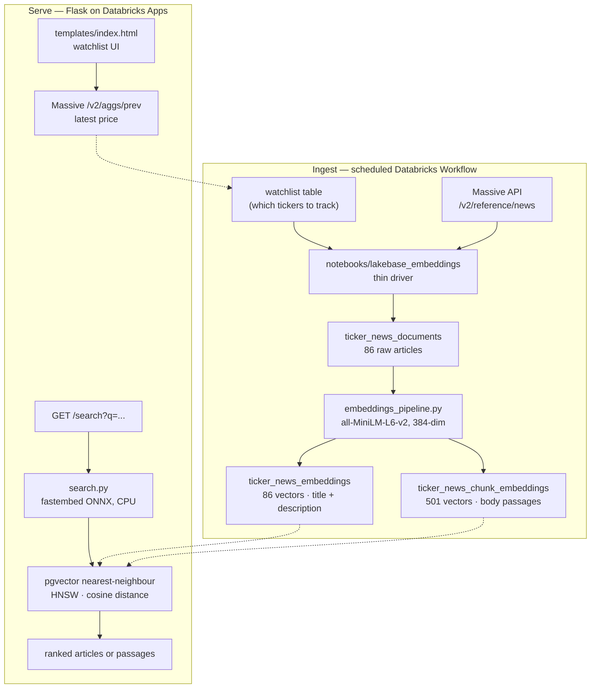

# Massive → Lakebase: semantic search over stock news

A Databricks App that pulls stock-news articles from the **Massive API** into
**Lakebase** (Databricks-managed Postgres), embeds them with a sentence-transformer
model, and serves cosine-similarity search over the corpus with **pgvector** — one
Postgres instance doing both the relational and the vector work, no separate vector
database.

A scheduled Databricks Workflow keeps the corpus fresh; a Flask app serves a
watchlist UI and a `/search` API on top of it.

## Results

Live figures from the deployed instance (PostgreSQL 17.10, pgvector 0.8.0):

| Measure | Value |
|---|---|
| Articles ingested | **86** (AAPL 47, MSFT 39) |
| Article embeddings | **86** — every document embedded, 0 unembedded |
| Body-chunk embeddings | **501** — avg 5.9 per article, range 1–29 |
| Vector column type | `vector`, **384 dims**, `all-MiniLM-L6-v2` |
| Index | HNSW, `vector_cosine_ops`, on both embedding tables |
| Referential integrity | 0 orphan chunks |

### Search quality

Real responses from `GET /search`, cosine similarity in `[0, 1]`:

```bash
curl "localhost:8000/search?q=AI+datacenter+capital+spending&limit=3"
```
```
0.6060  MSFT  Microsoft Just Proved that AI Spending Can Pay Off. Here's How
0.5930  MSFT  AI Inference Infrastructure Market Size to Surpass $229.95 Billion
0.5808  MSFT  Alphabet, Microsoft, Amazon, and Oracle Just Gained $1.9 Trillion
```

`mode=chunks` returns the specific passage that matched, which is what a RAG
prompt wants to quote rather than a headline:

```bash
curl "localhost:8000/search?q=iPhone+sales+in+China&mode=chunks&limit=2"
```
```
0.5657  AAPL  #0  Is Apple Stock a Buy on the Dip as iPhone Sales Surge?
        "Apple (AAPL +0.29%) continued its streak of strong iPhone sales during
         its fiscal third quarter, but the stock fell as service revenue and
         China sales…"
```

A nonsense query as a negative control — the scores collapse, which is the
evidence that the ranked results above are signal and not an artifact of every
vector being near every other one:

```bash
curl "localhost:8000/search?q=purple+bicycle+tuba+recipe&limit=2"
```
```
0.0583  AAPL  If a Stock Market Crash Is Coming, I'm Loading Up on This ETF
0.0515  MSFT  2 Energy Stocks With More Hype Than Fundamentals Right Now
```

## Architecture



The dotted edges cross a process boundary, not a storage one: `watchlist`, the raw
documents and both vector tables all live in the **same** Lakebase Postgres
database. The ingest side writes it on a schedule, the serving side reads it per
request.

## Engineering decisions

**fastembed (ONNX) instead of sentence-transformers for query embedding.**
The serving path only needs to place a query in the same vector space as the
stored embeddings, not to train anything. `sentence-transformers` would pull
~2.5GB of torch into the app image for that. `fastembed` runs the same
`all-MiniLM-L6-v2` weights as an ONNX graph on CPU. Measured against vectors this
project's own pipeline wrote, the two agree to **cosine 0.99+**, so rankings are
unchanged while the app stays small enough to cold-start quickly. The notebook,
which runs on an ML cluster where torch is already present, still uses
`sentence-transformers`.

**The HNSW index exists but the planner ignores it — and that's correct.**
At 501 rows a sequential scan beats an index probe, so `EXPLAIN` shows `Seq Scan`.
The index is there for when the corpus grows. Worth stating plainly rather than
claiming an index-accelerated search that isn't happening yet.

**`databricks_superuser` is not a Postgres superuser.** It has
`rolsuper = false`; it bundles `pg_read_all_data`, `pg_write_all_data`,
`pg_maintain` and `pg_monitor`. That is enough to read and write every table but
not to *own* one — so `CREATE INDEX IF NOT EXISTS` still fails with
`must be owner of table` (Postgres checks ownership before the `IF NOT EXISTS`
short-circuit). Combined with PostgreSQL 15 dropping the implicit `CREATE` grant
on schema `public`, this is the source of most first-run setup failures here; see
[`sql/README.md`](sql/README.md).

**Stable chunk IDs.** `chunk_id()` in `embeddings_pipeline.py` is
`sha256(f"{article_id}:{index}")[:32]` — derived from position, not content, and
deliberately not a random UUID. Re-running the pipeline over unchanged articles
therefore collides on the primary key and `ON CONFLICT (id) DO NOTHING` absorbs
it, instead of duplicating 501 rows every night.

**Credentials are never in the repo or the image.** The deployed app receives
`LAKEBASE_URL` and `MASSIVE_API_KEY` as environment variables injected by
Databricks from *app resources* (`valueFrom` in `app.yaml`), with an SDK
secret-scope read as fallback. Locally the same variables come from a gitignored
`.env`. The error handler in `app.py` deliberately does not echo exception text,
because a psycopg2 connection failure puts the whole DSN — password included —
into `str(err)`.

## Screenshots

<!-- Drop watchlist.png and search.png into docs/img/ (see docs/img/README.md for
     what to capture), then delete this comment's opening and closing markers to
     make the table below visible. Left commented out so the front page doesn't
     show two broken-image icons in the meantime.

| Watchlist UI | Semantic search |
|---|---|
|  |  |

-->

Not captured yet — see [`docs/img/README.md`](docs/img/README.md).

## Files

- `app.py` - Flask app: `/healthz`, `/records` (GET), `/sync` (POST), `/watchlist` (GET/POST/DELETE), `/news/sync` (POST), `/search` (GET)
- `lakebase.py` - Lakebase connection helper (single `LAKEBASE_URL`, psycopg2 + SQLAlchemy)
- `massive_client.py` - Massive API client: pagination generator for large datasets, `get_latest_price`, `get_news`
- `embeddings_pipeline.py` - Embedding stages (news sync, embed, chunk) as plain functions, so they can be tested outside Databricks
- `search.py` - Semantic search over the stored vectors, used by `/search`
- `setup_secrets.py` - One-time script to create the secret scopes and store the Massive API key + Lakebase URL
- `app.yaml` - Databricks App deployment config: the start command, plus `env` entries that map secret **app resources** to `LAKEBASE_URL` / `MASSIVE_API_KEY` via `valueFrom`
- `templates/index.html` - Watchlist UI (add + remove tickers)
- `notebooks/lakebase_embeddings.py` - ETL notebook (a thin driver over `embeddings_pipeline.py`): reads tickers from the `watchlist` table, fetches news for those tickers directly from Massive (rate-limited to 5 requests/min for the free API tier) into `ticker_news_documents`, computes title/description embeddings into `ticker_news_embeddings`, and fetches + chunks + embeds each article's full body (via `trafilatura`) into `ticker_news_chunk_embeddings` (pgvector)
- `databricks.yml` + `resources/lakebase_embeddings_job.yml` - Databricks Asset Bundle config that schedules the notebook above as a Workflow (see [Scheduling the embeddings notebook](#scheduling-the-embeddings-notebook-as-a-databricks-workflow))
- `.env.example` - Local dev env var template (copy to `.env`, do not commit real values)

## Step-by-step setup

### 1. Create a Massive.com account and get an API key

1. Go to [https://massive.com](https://massive.com) and sign up for a new account (or log in if you already have one).
2. Once logged in, open your account/workspace **Settings** (or **Developer** / **API** section, depending on Massive's current UI).
3. Find **API Keys** and click **Create API Key** (or **Generate New Key**).
4. Give the key a name (e.g. `databricks-app`) and copy the generated key value immediately — most providers only show it once.
5. Keep this key handy for step 3 (Store your secrets) below. Do **not** put it in code, `.env` committed to git, or anywhere else in plaintext.

> If Massive's console differs from the steps above, look for **API Keys**, **Tokens**, or **Credentials** under your account/organization settings — the key is what authenticates requests to `https://api.massive.com` in `massive_client.py`.

### 2. Create a Lakebase instance and a native-password role

1. In your Databricks workspace, go to **Catalog** (left sidebar) and select the **Lakebase** tab (or search "Lakebase" in the workspace search bar).
2. Click **Create Lakebase instance** (sometimes labeled **Create database instance**).
   - Give it a name (e.g. `massive-sync-db`).
   - Choose the capacity/compute size and region appropriate for your workload (defaults are fine to start).
   - Click **Create** and wait for the instance to reach the **Available**/**Running** state.
3. Open the newly created instance, then go to the **Roles & Databases** tab (sometimes called **Permissions** or **Roles**).
4. **Enable native (password) authentication** for the instance if it isn't already on:
   - Look for an authentication setting such as **Native passwords** or **Password authentication** and toggle/enable it. By default some Lakebase instances only support OAuth/token-based auth — you need password auth enabled so the role below gets a static password instead of a short-lived token.
5. **Create a new role**:
   - Click **Add role** / **Create role**.
   - Choose **Password** as the authentication method (not OAuth).
   - Name the role (e.g. `massive_app`) and let Databricks generate (or set) a password.
6. **Copy the connection URL** shown for the role. It will look like:

   ```
   postgresql://<role>:<password>@<your-lakebase-host>:5432/databricks_postgres?sslmode=require
   ```

   > ⚠️ **Paste the host whole; do not append a domain to it.** The host Databricks
   > shows you already includes its own — Lakebase is Neon-backed, so it typically
   > ends in `.cloud.databricks.com` or `.neon.tech` depending on your instance.
   > Pasting it into a template that already ends in `.database.cloud.databricks.com`
   > produces a doubled hostname that fails DNS resolution, and the resulting
   > psycopg2 error says `password authentication failed` — which sends you
   > rotating a password that was never wrong. Confirm with
   > `nslookup <your-lakebase-host>` before going further.

   Keep this URL — you'll paste it into `setup_secrets.py`'s prompt in the next step.

### 3. Store your secrets

`setup_secrets.py` creates both secret scopes and stores your two credentials. It
is idempotent — re-running it is safe.

> ⚠️ **Do not use `%sh python setup_secrets.py`.** The `%sh` magic runs the script
> in a subshell with no TTY, so the password prompt never reaches you and the cell
> hangs forever. Use one of the two options below.

**Option A — Databricks notebook (no CLI needed).** Create a notebook in the Git
folder from step 7 (or import the repo first), attach it to a cluster, and run
this in a **Python** cell:

```python
exec(open("setup_secrets.py").read())
```

Notebook Python cells support interactive `input()`, so you'll get prompts for
your Lakebase URL and Massive API key. They echo in plaintext — clear the cell
output when you're done.

**Option B — your own terminal (input is masked).** Requires Databricks auth for
the SDK: create a personal access token in **Settings > Developer > Access
tokens**, then:

```bash
export DATABRICKS_HOST=https://<your-workspace>.cloud.databricks.com
export DATABRICKS_TOKEN=<your-pat>
python setup_secrets.py
```

Either way you're prompted for:
- Your **Lakebase connection URL** (from step 2) → stored as secret `database/lakebase-url`
- Your **Massive API key** (from step 1) → stored as secret `massive/api-key`

The script prints the stored key names (never the values) at the end so you can
confirm it worked. To skip the prompts entirely, pre-set `LAKEBASE_URL` and
`MASSIVE_API_KEY` in the environment.

### 3b. Grant the role permission to create tables

Run `sql/00_grant_app_role.sql` once **against the Lakebase Postgres database**,
as your own Databricks identity (it belongs to `databricks_superuser`):

```sql
GRANT CREATE ON SCHEMA public TO massive_app;
```

> ⚠️ Not in a notebook `%sql` cell — that targets Unity Catalog and fails with
> `PRINCIPAL_DOES_NOT_EXIST`, because `massive_app` is a Postgres role, not a
> Databricks principal. Use the Lakebase instance's query editor, `psql`, or
> psycopg2 from a Python cell; the file's header comment shows all three.
>
> Skip this entirely if the role is already a member of `databricks_superuser`.

Skip this and the app starts fine but every database call fails with
`permission denied for schema public`. As of PostgreSQL 15 the `public` schema
no longer grants `CREATE` to all roles, so a new Lakebase password role gets
`USAGE` but not `CREATE`, and the `ensure_*_table()` helpers in `app.py` can't
create their tables.

### 4. Configure environment variables (local dev)

```bash
cp .env.example .env
```

Then fill in `LAKEBASE_URL` and `MASSIVE_API_KEY` in `.env`. These are **local-dev
overrides**: when they're set, the app connects directly and never contacts
Databricks — which means you can run locally without any Databricks auth at all.
Leave them unset and the app falls back to reading the secret scopes.

On Databricks Apps there is no `.env`. The same two variables are supplied by the
platform instead: `app.yaml` declares them with `valueFrom`, naming **app
resources** that Databricks resolves to the decrypted secret values and injects
into the app's environment. See [step 7.3](#7-create-a-git-folder-in-databricks-and-deploy-the-app-no-cli-required)
for how to create those resources.

Either way the application code is identical — `lakebase.py` and
`massive_client.py` read `LAKEBASE_URL` / `MASSIVE_API_KEY` from the environment
and don't care who put them there. Both log which source they used (never the
value) at startup, so a misconfigured resource shows up in the app logs instead of
silently falling through.

### 5. Install dependencies

This project uses [uv](https://docs.astral.sh/uv/) with Python 3.13:

```bash
uv venv
uv pip install -r requirements.txt
```

(Plain `pip install -r requirements.txt` works too. Note `pyproject.toml` has an
empty `dependencies` list — `requirements.txt` is the source of truth, so
`uv sync` will not install anything.)

### 6. Run locally

```bash
python app.py
```

Then open http://localhost:8000. The `watchlist` table is created automatically on
the first request — no manual SQL needed for the UI. Sanity check:

```bash
curl localhost:8000/healthz     # {"status":"ok"}
curl localhost:8000/watchlist   # [] on a fresh database
```

### 7. Create a Git folder in Databricks and deploy the app (no CLI required)

All of this is done through the Databricks workspace UI:

1. **Create a Git folder**:
   - In the Databricks workspace sidebar, click **Workspace** > **Create** > **Git folder** (in older UIs this is called **Repos** > **Add Repo**).
   - Paste the Git URL of this project's repository (e.g. your GitHub/GitLab remote for this codebase).
   - Choose a folder name and click **Create Git folder**. Databricks will clone the repo directly into your workspace — this becomes the source for your app.

2. **Create the Databricks App**:
   - In the sidebar, go to **Compute** > **Apps** (or search "Apps" in the workspace search bar).
   - Click **Create app**, then choose **Custom** (or "From scratch").
   - Give the app a name (e.g. `massive-lakebase-sync`).

3. **Point the app at your Git folder**:
   - When prompted for the source code location, select **Workspace files** / **Git folder** and browse to the Git folder you created in step 1 (the folder containing `app.py` and `app.yaml`).
   - Databricks reads `app.yaml` from that folder automatically to configure the `command` and `env`.

   **Then add the two secret resources**, or the app will start but every request
   will fail. On the app's page: **Edit** > **App resources** > **+ Add resource**
   > **Secret**, twice:

   | Resource key | Scope | Key | Permission |
   |---|---|---|---|
   | `lakebase-url` | `database` | `lakebase-url` | Can read |
   | `massive-api-key` | `massive` | `api-key` | Can read |

   The resource key is what `app.yaml` refers to:

   ```yaml
   - name: LAKEBASE_URL
     valueFrom: lakebase-url
   - name: MASSIVE_API_KEY
     valueFrom: massive-api-key
   ```

   `valueFrom` resolves to the **decrypted secret value**, so nothing sensitive
   is ever written to `app.yaml` or committed. Creating the resource also grants
   the app's service principal read access on that secret — which is why there is
   no separate `databricks secrets put-acl` step.

4. **Deploy**:
   - Click **Deploy** (or **Create and deploy**) in the Apps UI. Databricks will build and start the app using the Git folder's current contents — no `databricks` CLI commands are needed.
   - Whenever you update the code, pull the latest changes into the Git folder (**Git folder** > **Pull**, via the UI) and click **Deploy** again in the Apps UI to redeploy.

5. **Find your app's URL.** Apps do **not** appear under Workspace, and not under
   your Lakebase instance either - they are their own resource. Go to
   **Compute > Apps** and click the app; the URL is on its detail page and looks
   like:

   ```
   https://<app-name>-<number>.<region>.databricksapps.com
   ```

   That is the production equivalent of `http://localhost:8000`. Everything the
   app serves locally is served there on the same paths - `/healthz`,
   `/watchlist`, `/search`, and the UI at `/`.

### The app URL is not public, and cannot be made public

Databricks Apps are access-controlled: you must be signed in to the workspace and
hold permission on the app. Opening the URL in a private window shows a login
page. The two permission levels are `CAN USE` and `CAN MANAGE`, and the broadest
sharing option — the `All account users` group — still means users in **your**
Databricks account.

There is no anonymous option. Per the Databricks documentation: *"You can't make
Databricks apps public. Anonymous access and bypassing single sign-on (SSO) are
not supported."* Someone who has a Databricks login through their own employer is
in a different account and will be denied; letting them in would mean provisioning
them as a user in your account.

So this URL is not a demo link you can hand out. For that, deploy a read-only
build elsewhere against a `SELECT`-only Postgres role — see the note at the end of
this README.

### Deployment gotchas

- **Add the two secret resources** (step 7.3). Without them `LAKEBASE_URL` and
  `MASSIVE_API_KEY` are unset, the app falls back to reading the secret scopes
  through the SDK, and that path needs the service principal to hold READ on both
  scopes:

  ```bash
  databricks secrets put-acl database <app-service-principal-id> READ
  databricks secrets put-acl massive   <app-service-principal-id> READ
  ```

  The resource route is preferred: it needs no ACL management, and it avoids a
  Databricks API round trip on the first credential read. Check the app logs for
  `resolved from the LAKEBASE_URL environment variable` to confirm which path is
  actually in use.

- **Port.** Databricks Apps assigns a port and injects it as `DATABRICKS_APP_PORT`;
  `app.py` reads that first and only falls back to `FLASK_RUN_PORT`/8000 locally.
  Binding to the wrong port leaves the app stuck "starting" - the platform health
  check never passes.

- **First `/search` is slow.** The embedding model (~50MB) downloads on first use
  into `FASTEMBED_CACHE_PATH` (`/tmp/.cache/fastembed`). `/tmp` does not survive a
  restart, so the first search after each deploy pays that cost again.

- **A Git folder is not required.** Apps deploy from any workspace path. If the
  Git folder is broken, `databricks sync . /Workspace/Users/<you>/<dir>` gets the
  code there without git.

## Endpoints

- `GET /healthz` - health check
- `GET /records?limit=100` - read synced records from Lakebase
- `POST /sync?batch_size=500` with optional JSON body `{"path": "/records"}` - pull from Massive API and upsert into Lakebase
- `GET /watchlist` - get the current user's watchlist symbols with last known price
- `POST /watchlist` - add/update a symbol on the current user's watchlist
- `DELETE /watchlist/<symbol>` - remove a symbol from the current user's watchlist
- `POST /news/sync` with optional JSON body `{"tickers": ["AAPL", "MSFT"], "limit": 50}` - pull recent news per ticker from Massive and upsert into `ticker_news_documents`
- `GET /search?q=...` - semantic search over the embedded news corpus

### `GET /search`

| param | default | notes |
|---|---|---|
| `q` | *(required)* | free-text query |
| `mode` | `articles` | `articles` ranks whole stories by title+description; `chunks` ranks passages from article bodies |
| `limit` | `10` | capped at 50 |
| `ticker` | *(all)* | restrict to one symbol, e.g. `MSFT` |

```bash
curl "localhost:8000/search?q=AI+datacenter+capital+spending&limit=4"
curl "localhost:8000/search?q=iPhone+sales+in+China&mode=chunks&limit=3"
```

Use `mode=chunks` when feeding context to an LLM - it returns the specific
passage that matched, not just the headline.

Query vectors have to come from the same model that produced the stored ones
(`all-MiniLM-L6-v2`, 384 dims), or the cosine distances are meaningless. The app
runs that model through `fastembed` (ONNX, CPU) rather than
`sentence-transformers`, which would drag in ~2.5GB of torch. The two agree to
cosine 0.99+ on identical input, so rankings match while the app stays small.
The model downloads on first search (~50MB, cached in `FASTEMBED_CACHE_PATH`,
default `/tmp/.cache/fastembed`), so expect the first query to be slow.

Returns an empty `results` list if the embeddings notebook has not run yet.

## Scheduling the embeddings notebook as a Databricks Workflow

`notebooks/lakebase_embeddings.py` reads the distinct tickers from the `watchlist`
table, fetches news for those tickers from Massive (serially, rate-limited to
`max_requests_per_minute` - 5/min by default, matching the free Massive API tier's
strict limits), and upserts them into `ticker_news_documents`. It then turns those
rows into vector embeddings in `ticker_news_embeddings` (title + description) and
`ticker_news_chunk_embeddings` (chunks of the full article body, fetched from each
article's `article_url` and extracted with `trafilatura`).

The notebook is a thin driver: the stages live in `embeddings_pipeline.py` at the
repo root, so they can be tested outside Databricks. **It must run from a Git
folder containing the whole repo** — importing the notebook file on its own will
fail, since it needs `embeddings_pipeline`, `lakebase` and `massive_client`
alongside it.

You can run it on a schedule two ways — pick whichever fits your setup:

### Option A: Databricks Asset Bundle (CLI, version-controlled)

This repo already includes bundle config for this: `databricks.yml` +
`resources/lakebase_embeddings_job.yml`. This is the recommended path if you want the
job definition tracked in git alongside the code.

1. Point the CLI at your workspace. `databricks.yml` deliberately does **not**
   hardcode a host, so use standard Databricks auth — either
   `export DATABRICKS_HOST=... DATABRICKS_TOKEN=...`, or a named profile with
   `-p <profile>`. Confirm with `databricks bundle validate -t dev`.
2. Deploy: `databricks bundle deploy -t dev`
3. Test it once manually: `databricks bundle run lakebase_embeddings_job -t dev`
4. Once you've confirmed a successful run, flip `pause_status: PAUSED` to `pause_status: UNPAUSED`
   in `resources/lakebase_embeddings_job.yml` and redeploy to turn on the daily schedule.

### Option B: Workflows UI (no CLI required)

If you'd rather not use the CLI, you can create the equivalent job by hand in the Databricks UI:

1. **Get the notebook into your workspace**: if you already created a Git folder for this repo
   (see step 7 above), the notebook is already there at `notebooks/lakebase_embeddings.py`.
   Otherwise, upload/import it via **Workspace** > **Create** > **Notebook** > **Import**.
2. **Create the job**: go to **Workflows** (left sidebar) > **Jobs** > **Create Job**.
3. **Add a task**:
   - Task type: **Notebook**.
   - Notebook path: browse to `notebooks/lakebase_embeddings.py` in your Git folder.
   - Cluster: choose **New job cluster** and pick a **Databricks Runtime for Machine
     Learning** version. It ships `torch` and `sentence-transformers`; on a standard
     runtime the notebook's `%pip` cell reinstalls ~2GB of torch on every run.
     A **single node** is right — the notebook is driver-side Python and never
     distributes work, so workers only add cost.
   - **Parameters are optional.** Every widget defaults to the correct value.
     Override only what you want to change:

     | parameter | default |
     |---|---|
     | `embedding_model` | `sentence-transformers/all-MiniLM-L6-v2` |
     | `news_fetch_limit` | `50` |
     | `max_requests_per_minute` | `5` |
     | `chunk_size` / `chunk_overlap` | `800` / `100` |
     | `skip_news_sync` | `false` |
     | `skip_chunks` | `false` — set `true` if the cluster can't reach publisher sites |

     Table names and the secret scope/key are **not** widgets: they come from the
     defaults in `lakebase.py` and `massive_client.py`, overridable via env vars.
4. **Add a schedule**: click **Add trigger** on the job, choose **Scheduled**, and set it to run
   daily (e.g. 6:00 AM UTC) using either the simple picker or a cron expression
   (`0 0 6 * * ?`, timezone UTC).
5. **Add a failure notification**: under **Notifications**, add your email/Slack webhook for
   on-failure alerts.
6. Click **Create** and optionally **Run now** to validate the job before its first scheduled run.

Both options produce the same result — a Databricks Workflow that runs the notebook and refreshes
`ticker_news_embeddings`. The Asset Bundle keeps the definition in git and reproducible across
workspaces; the UI path is quicker for a one-off class demo but isn't tracked in version control.

## Enabling Change Data Feed (CDF) for Postgres tables

Lakebase supports **Change Data Feed (CDF)**, a managed way to stream row-level inserts/updates/deletes
from your Lakebase Postgres tables into Unity Catalog Delta tables (no Debezium, no custom connectors).
CDF is enabled per-**schema** in the `databricks_postgres` database, and every table in that schema that
meets two conditions is picked up automatically: it has `REPLICA IDENTITY FULL` set, and it has at least
one row.

> **Note:** CDF is only available on paid Databricks accounts — it is not supported on the free
> Databricks Community Edition or trial tier.

### 1. Set `REPLICA IDENTITY FULL` on the tables you want to track

By default, Postgres only logs primary-key columns on change. To capture full row contents (needed for
CDF), enable `REPLICA IDENTITY FULL` on each table — including `watchlist` and `massive_records` from
this app:

```sql
ALTER TABLE watchlist REPLICA IDENTITY FULL;
ALTER TABLE massive_records REPLICA IDENTITY FULL;
```

Run this once per table, either from a Databricks SQL editor connected to your Lakebase instance, or
from a `psql` session using your `LAKEBASE_URL`. Any new table you add later (e.g. via `ensure_table`-style
helpers in `app.py`) needs the same `ALTER TABLE ... REPLICA IDENTITY FULL` statement run once before it
will be included in the feed. Tables with the setting but zero rows are skipped until the first row is
inserted, then picked up automatically.

You can confirm which tables currently qualify by querying:

```sql
SELECT * FROM wal2delta.tables;
```

### 2. Start CDF from the Lakebase UI

1. In your Databricks workspace, open the **Lakebase** tab for your instance.
2. Go to **Lakebase CDF** and click **Start**.
3. Select the `databricks_postgres` database and the schema containing your tables (the default
   schema, `public`, works — it's inside `databricks_postgres`).
4. Choose the Unity Catalog destination schema/catalog where the CDF history tables should land.
5. Confirm — the UI shows a preview of qualifying tables (e.g. `watchlist`, `massive_records`) and
   their sync status before you start.

Once running, each qualifying table gets a corresponding Delta table named `lb_<table_name>_history`
(e.g. `lb_watchlist_history`) in Unity Catalog, updated roughly every 15 seconds. Each row includes
metadata columns (`_pg_change_type`, `_pg_lsn`, `_pg_xid`, `_timestamp`, `_sort_by`) describing the
change, so downstream Delta Live Tables/pipelines can build Silver/Gold layers off the append-only
history.

> **Note:** Disabling CDF is lossy — changes made while it's off aren't captured, and re-enabling
> triggers a full resync (every row reloaded as an `insert`). There's no per-table exclusion option
> within an enabled schema; the only way to keep a table out of the feed is to not set
> `REPLICA IDENTITY FULL` on it.

## Notes

- Lakebase auth uses a single `LAKEBASE_URL` secret pointing at a native Postgres role with a
  static, non-expiring password — no token refresh logic needed in `lakebase.py`.
- The Massive API pagination in `massive_client.py` assumes a `{"items": [...], "next_cursor": ...}`
  cursor-based shape. Adjust `paginated_get` to match the real API's pagination contract.
- For very large batch upserts, consider `psycopg2.extras.execute_values` instead of per-row inserts.

## Running a publicly reachable demo

Because a Databricks App can't be opened to anonymous visitors, a shareable live
demo has to be deployed outside Databricks. Lakebase is an ordinary Postgres
endpoint over TLS, so an external host can read from it directly — but not with
this app's credentials. What that build needs:

- **A dedicated `demo_readonly` Postgres role** with `SELECT` on the four tables
  and nothing else. Notably *not* a member of `databricks_superuser`, which the
  app's `massive_app` role currently is — that carries `pg_write_all_data` across
  the entire database.
- **Search-only routes.** Expose `GET /search`; drop `/sync`, `/news/sync`, and
  the watchlist write and delete routes.
- **No Massive API key deployed at all.** Search reads vectors that are already in
  Postgres, so the public build never calls Massive — nothing to leak, and no risk
  to the free tier's 5 requests/minute budget.
- **Stop trusting `X-Forwarded-Email`.** `_current_user_email()` in `app.py` reads
  that header to identify the user. Inside Databricks the platform sets it and
  strips client-supplied copies; outside, nothing does, and it becomes a free
  identity spoof.
- **Rate limiting**, and the redacted error handler already in `app.py`.
- A free host with ~1GB of RAM for the ONNX runtime and the 50MB model.

Confirm too that the Lakebase instance has no IP access list that would reject the
host's egress addresses.
